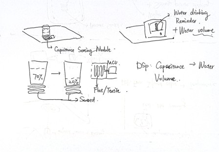
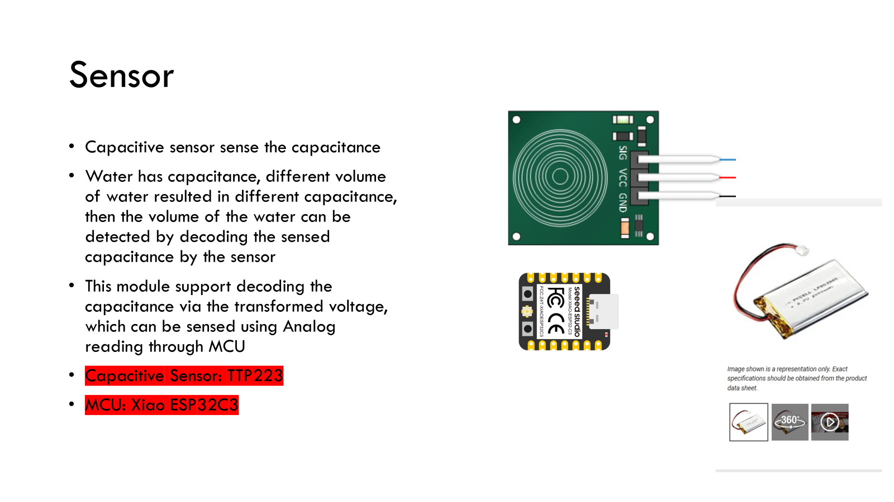
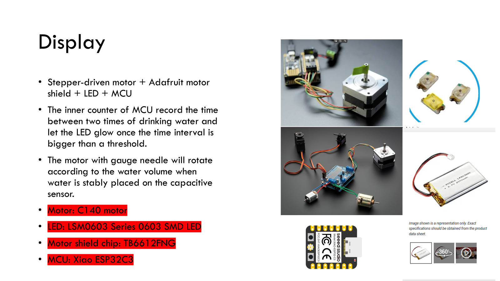
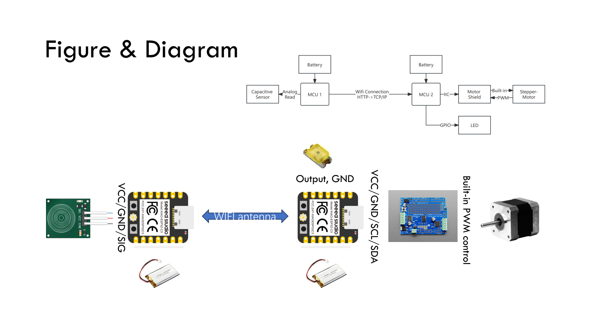

### On-table drinking reminder

##### Overview

This project aims to design a wireless smart water monitoring system that tracks the water volume in a cup placed on a table and reminds users to drink water in a timely manner. By combining capacitive sensing, wireless communication, and algorithmic processing, the system supports healthier daily hydration habits with minimal user intervention.

 

##### Idea

The core idea is to wirelessly monitor the water volume on a table (visualized by needle gauge) and provide intelligent drinking reminders based on real-time sensing and usage patterns. The system continuously estimates the remaining water volume and determines when a reminder (LED) should be triggered.

